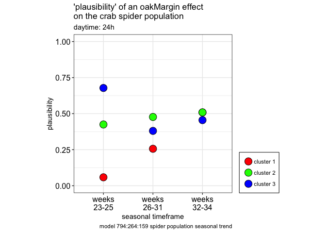
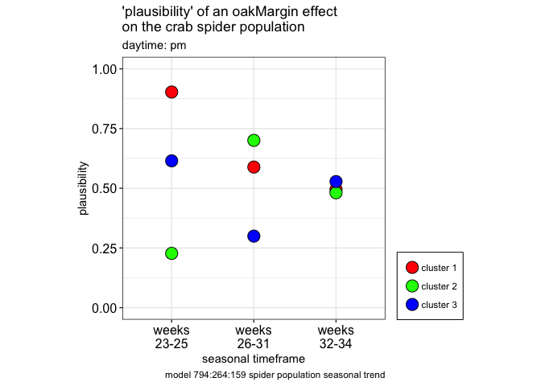
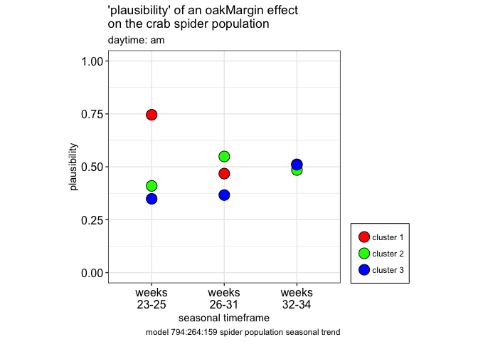

brm confusion
================

``` r
suppressPackageStartupMessages(library(dplyr))

library(ggplot2)
library(dplyr)

source('./code/likelihood-ugly.R')   

  # grab data, 372 observations
  # "week", "transect", "time", "cluster", "totalSpiders"
  # 
  # (this dataframe was generated by the likelihood-ugly.R function generateLikelihoodV2() )
  #

source.url <- c("https://raw.githubusercontent.com/cordphelps/brm/master/data/clusterData.csv")
clusterData.df <- read.csv(source.url, header=TRUE, row.names=NULL)
```

### How plausible is it that an oakMargin transect row will have more spiders than a control transect row?

``` r
#   plot likelihood for all observations (24 hours), for daylight observations (collected in the 'pm'), and 
#   for nighttime observations (collected in the 'am')
#

    gg.likelihood <- generateLikelihoodV2(df=clusterData.df, daytime='24h')
```

    ## Loading required package: Rcpp

    ## Loading 'brms' package (version 2.6.0). Useful instructions
    ## can be found by typing help('brms'). A more detailed introduction
    ## to the package is available through vignette('brms_overview').
    ## Run theme_set(theme_default()) to use the default bayesplot theme.

    ## Loading required package: StanHeaders

    ## rstan (Version 2.17.3, GitRev: 2e1f913d3ca3)

    ## For execution on a local, multicore CPU with excess RAM we recommend calling
    ## options(mc.cores = parallel::detectCores()).
    ## To avoid recompilation of unchanged Stan programs, we recommend calling
    ## rstan_options(auto_write = TRUE)

    ## Compiling the C++ model

    ## Start sampling

    ## Compiling the C++ model

    ## recompiling to avoid crashing R session

    ## Start sampling

    ## Compiling the C++ model

    ## recompiling to avoid crashing R session

    ## Start sampling

    ## Compiling the C++ model

    ## recompiling to avoid crashing R session

    ## Start sampling

    ## Compiling the C++ model

    ## recompiling to avoid crashing R session

    ## Start sampling

    ## Compiling the C++ model

    ## recompiling to avoid crashing R session

    ## Start sampling

    ## Compiling the C++ model

    ## recompiling to avoid crashing R session

    ## Start sampling

    ## Compiling the C++ model

    ## recompiling to avoid crashing R session

    ## Start sampling

    ## Compiling the C++ model

    ## recompiling to avoid crashing R session

    ## Start sampling

    ## 
    ## Attaching package: 'gridExtra'

    ## The following object is masked from 'package:dplyr':
    ## 
    ##     combine

``` r
    print(gg.likelihood)
```



``` r
    filtered.df <- clusterData.df %>% dplyr::filter(time == 'pm')
    gg.likelihood <- generateLikelihoodV2(df=filtered.df, daytime='pm')
```

    ## Loading 'brms' package (version 2.6.0). Useful instructions
    ## can be found by typing help('brms'). A more detailed introduction
    ## to the package is available through vignette('brms_overview').
    ## Run theme_set(theme_default()) to use the default bayesplot theme.

    ## rstan (Version 2.17.3, GitRev: 2e1f913d3ca3)

    ## For execution on a local, multicore CPU with excess RAM we recommend calling
    ## options(mc.cores = parallel::detectCores()).
    ## To avoid recompilation of unchanged Stan programs, we recommend calling
    ## rstan_options(auto_write = TRUE)

    ## Compiling the C++ model

    ## recompiling to avoid crashing R session

    ## Start sampling

    ## Compiling the C++ model

    ## recompiling to avoid crashing R session

    ## Start sampling

    ## Compiling the C++ model

    ## recompiling to avoid crashing R session

    ## Start sampling

    ## Compiling the C++ model

    ## recompiling to avoid crashing R session

    ## Start sampling

    ## Compiling the C++ model

    ## recompiling to avoid crashing R session

    ## Start sampling

    ## Compiling the C++ model

    ## recompiling to avoid crashing R session

    ## Start sampling

    ## Compiling the C++ model

    ## recompiling to avoid crashing R session

    ## Start sampling

    ## Compiling the C++ model

    ## recompiling to avoid crashing R session

    ## Start sampling

    ## Compiling the C++ model

    ## recompiling to avoid crashing R session

    ## Start sampling

``` r
    print(gg.likelihood) 
```



``` r
    filtered.df <- clusterData.df %>% dplyr::filter(time == 'am')
    gg.likelihood <- generateLikelihoodV2(df=filtered.df, daytime='am')
```

    ## Loading 'brms' package (version 2.6.0). Useful instructions
    ## can be found by typing help('brms'). A more detailed introduction
    ## to the package is available through vignette('brms_overview').
    ## Run theme_set(theme_default()) to use the default bayesplot theme.

    ## rstan (Version 2.17.3, GitRev: 2e1f913d3ca3)

    ## For execution on a local, multicore CPU with excess RAM we recommend calling
    ## options(mc.cores = parallel::detectCores()).
    ## To avoid recompilation of unchanged Stan programs, we recommend calling
    ## rstan_options(auto_write = TRUE)

    ## Compiling the C++ model

    ## recompiling to avoid crashing R session

    ## Start sampling

    ## Compiling the C++ model

    ## recompiling to avoid crashing R session

    ## Start sampling

    ## Compiling the C++ model

    ## recompiling to avoid crashing R session

    ## Start sampling

    ## Compiling the C++ model

    ## recompiling to avoid crashing R session

    ## Start sampling

    ## Compiling the C++ model

    ## recompiling to avoid crashing R session

    ## Start sampling

    ## Compiling the C++ model

    ## recompiling to avoid crashing R session

    ## Start sampling

    ## Compiling the C++ model

    ## recompiling to avoid crashing R session

    ## Start sampling

    ## Compiling the C++ model

    ## recompiling to avoid crashing R session

    ## Start sampling

    ## Compiling the C++ model

    ## recompiling to avoid crashing R session

    ## Start sampling

``` r
    print(gg.likelihood) 
```


